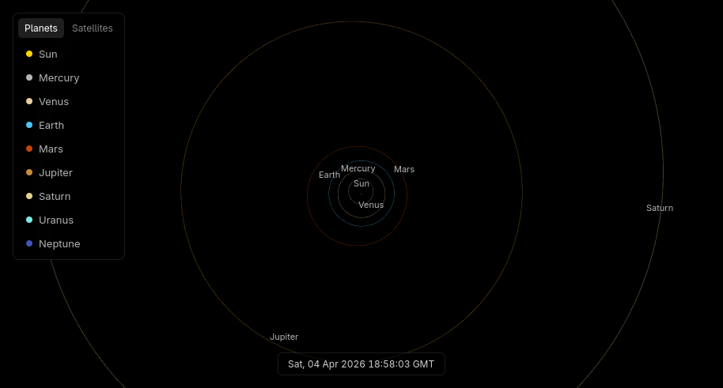
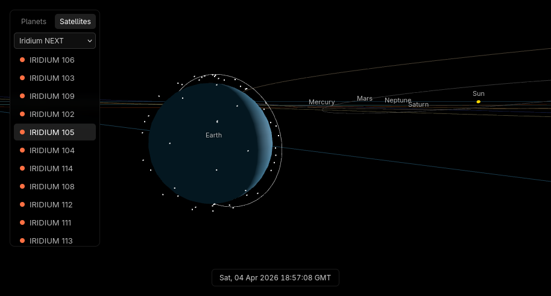

# space-map
3D view of the solar system with live data fetched from JPL's [Horizons API](https://ssd-api.jpl.nasa.gov/doc/horizons.html) and [CelesTrak](https://celestrak.org/).

## Stack
- Frontend: Three.js, Vue.js
- Backend: Maven, Spring Boot, Caffeine
## Screenshots

